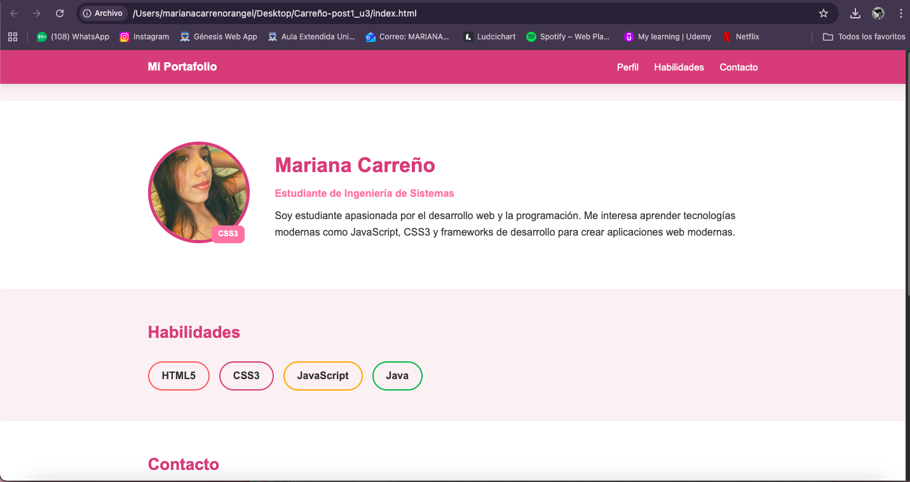

# Página de Perfil Personal

**Nombre:** Mariana Carreño  
**Carrera:** Ingeniería de Sistemas  

## Descripción
Este proyecto consiste en una página web de perfil personal desarrollada con HTML5 y CSS3 aplicando conceptos como selectores CSS, Box Model, posicionamiento y estilos de formularios accesibles.

## Tecnologías utilizadas
- HTML5
- CSS3

## Instrucciones de ejecución
1. Clonar el repositorio.
2. Abrir el archivo `index.html`.
3. Ejecutarlo con la extensión **Live Server** en Visual Studio Code.

## Captura de pantalla

